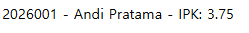
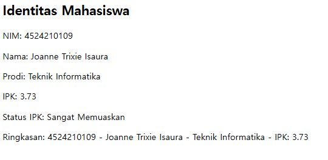
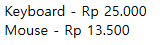
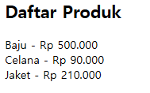

  <h1>LAPORAN PRAKTIKUM  
  PRAK. PEMROGRAMAN BERBASIS WEB</h1>

<b>Dosen Pengampu: </b> 
Ari Wibowo, S.Kom., M.Kom., C. Pro

 
 

 
 
 

<b>Disusun Oleh:</b> 
Joanne Trixie Isaura   4524210109

 
 

<h1>PROGRAM STUDI TEKNIK INFORMATIKA 
FAKULTAS TEKNIK  
UNIVERSITAS PANCASILA 
2026</h1>

 

  <h2>Tugas 2</h2>

<table>
  <tr>
    <th>File</th>
    <th>Sebelum</th>
    <th>Sesudah</th>
  </tr>

  <tr>
    <th>Identitas</th>
    <th>
         
        

</th>
    <th></th>
  </tr>
</table>

<b>Penjelasan</b> 
Perbedaan kode sebelum dan sesudah terletak pada penambahan atribut, metode, dan tampilan output. Pada kode sesudah, ditambahkan atribut $prodi untuk menyimpan program studi mahasiswa dan parameter prodi pada constructor. Selain itu, ditambahkan metode statusIpk() untuk menentukan status IPK berdasarkan nilai IPK. Data mahasiswa juga diubah menjadi data pengguna, yaitu NIM, nama, prodi, dan IPK. Pada bagian akhir, kode sesudah menampilkan data mahasiswa secara lebih lengkap menggunakan beberapa echo, seperti NIM, nama, prodi, IPK, status IPK, dan ringkasan. Sementara itu, kode sebelum hanya menampilkan ringkasan NIM, nama, dan IPK tanpa informasi prodi maupun status IPK.

 
<table>
  <tr>
    <th>File</th>
    <th>Sebelum</th>
    <th>Sesudah</th>
  </tr>
  
  <tr>
    <th>Hitung</th>
    <th></th>
    <th></th>
  </tr>
</table>

<b>Penjelasan:</b> 
Perbedaan kode sebelum dan sesudah terletak pada penambahan class ProdukPajak dan perubahan cara penulisan atribut pada class Produk dan ProdukDiskon. Pada kode sesudah, atribut $nama, $harga, dan $diskon dideklarasikan secara terpisah, kemudian nilainya diisi melalui constructor. Selain itu, ditambahkan class ProdukPajak sebagai turunan dari Produk yang menghitung harga akhir dengan menambahkan persentase pajak. Data produk juga diubah menjadi Baju, Celana, dan Jaket, sehingga kode sesudah dapat menunjukkan penerapan inheritance dan polymorphism melalui tiga jenis perhitungan harga yang berbeda, yaitu harga normal, harga setelah diskon, dan harga setelah pajak.

