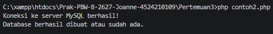
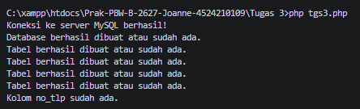

  <h1>LAPORAN PRAKTIKUM  
  PRAK. PEMROGRAMAN BERBASIS WEB</h1>

<b>Dosen Pengampu: </b> 
Ari Wibowo, S.Kom., M.Kom., C. Pro

 
 

 
 
 

<b>Disusun Oleh:</b> 
Joanne Trixie Isaura   4524210109

 
 

<h1>PROGRAM STUDI TEKNIK INFORMATIKA 
FAKULTAS TEKNIK  
UNIVERSITAS PANCASILA 
2026</h1>

 

  <h2>Tugas 3</h2>

<table>
  <tr>
    <th>File</th>
    <th>Sebelum</th>
    <th>Sesudah</th>
  </tr>

  <tr>
    <th>contoh 2</th>
    <th>
         
        

</th>
    <th></th>
  </tr>
</table>

<b>Penjelasan:</b> 
Pada kode sebelum, program digunakan untuk membuat database akademik serta beberapa tabel utama seperti mahasiswa, dosen, mata_kuliah, krs, dan mk_krs yang dilengkapi dengan primary key, unique, dan foreign key untuk menghubungkan tabel. Sedangkan pada kode sesudah, struktur pembuatan database dan tabel yang sudah ada tetap dipertahankan, tetapi tabel krs dan mk_krs digantikan dengan tabel kelas yang memiliki kolom id, nama_kelas, dan semester. Selain itu, kode sesudah menambahkan proses pengecekan kolom no_tlp pada tabel mahasiswa menggunakan SHOW COLUMNS; jika kolom tersebut belum ada, program akan menambahkannya menggunakan ALTER TABLE, sedangkan jika sudah ada maka program akan memberikan informasi bahwa kolom tersebut sudah tersedia. Kode sesudah juga menambahkan foreach untuk menjalankan seluruh query pembuatan tabel dan menampilkan status berhasil atau gagal untuk setiap tabel, serta menutup koneksi dengan mysqli_close($koneksi).

