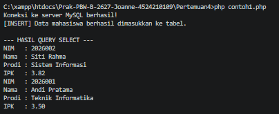
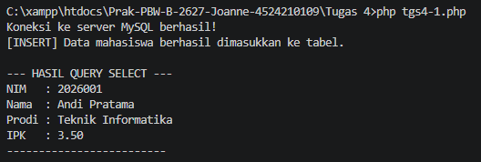
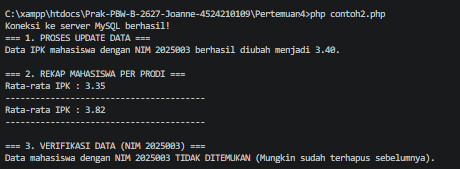
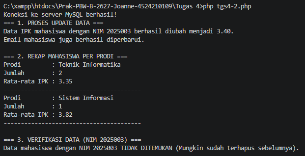

  <h1>LAPORAN PRAKTIKUM  
  PRAK. PEMROGRAMAN BERBASIS WEB</h1>

<b>Dosen Pengampu: </b> 
Ari Wibowo, S.Kom., M.Kom., C. Pro

 
 

 
 
 

<b>Disusun Oleh:</b> 
Joanne Trixie Isaura   4524210109

 
 

<h1>PROGRAM STUDI TEKNIK INFORMATIKA 
FAKULTAS TEKNIK  
UNIVERSITAS PANCASILA 
2026</h1>

 

  <h2>Tugas 4</h2>

<table>
  <tr>
    <th>File</th>
    <th>Sebelum</th>
    <th>Sesudah</th>
  </tr>

  <tr>
    <th>contoh 1</th>
    <th>
         
        

</th>
    <th></th>
  </tr>
</table>

<b>Penjelasan:</b> 
Pada kode sebelum, program hanya melakukan proses INSERT untuk memasukkan data mahasiswa dan SELECT untuk menampilkan mahasiswa dengan IPK minimal 3.50. Pada kode sesudah, program mengalami sedikit modifikasi dengan menambahkan proses DELETE data lama berdasarkan NIM sebelum INSERT agar data tidak mengalami duplikasi ketika program dijalankan kembali, serta kondisi pada SELECT ditambahkan prodi = 'Teknik Informatika' sehingga data yang ditampilkan lebih spesifik. Selain itu, hasil SELECT juga diberikan garis pemisah agar output lebih mudah dibaca. Perubahan ini tetap mempertahankan struktur utama kode sebelumnya, tetapi menambahkan query dan kondisi baru.

 
<table>
  <tr>
    <th>File</th>
    <th>Sebelum</th>
    <th>Sesudah</th>
  </tr>
  
  <tr>
    <th>contoh 2</th>
    <th></th>
    <th></th>
  </tr>
</table>

<b>Penjelasan:</b> 

